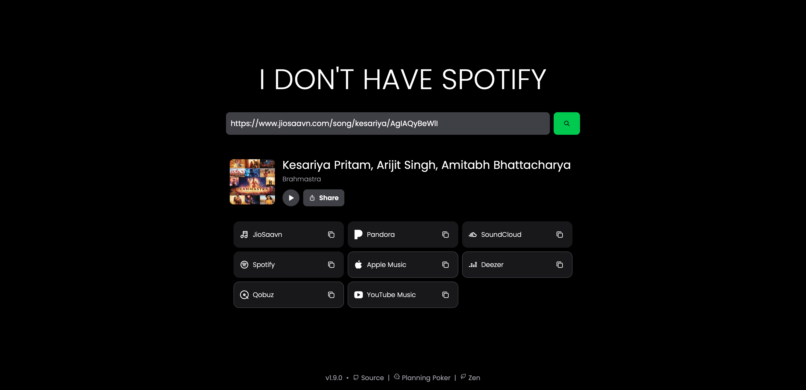

> IDHS (I Don't Have Spotify)

You get a link on a streaming service you don't use, and you want to hear the song anyway. Copy the link, paste it into the search bar, and the app hands back the same track on every other service it knows about. When the original link comes from Spotify you even get a short audio preview, so you can confirm it found the right song before you tap through.

Playlists are deliberately out of scope. The app converts individual tracks, albums, artists, and podcasts, and it does that one job well instead of many jobs poorly.

## How a link becomes links

Every conversion runs through two stages, and keeping them separate is what makes a new service easy to add.

First a parser figures out which platform your link came from and pulls out normalized metadata: the title, the artist, what kind of thing it is, cover art when it can find it. From that metadata it builds one clean search query, the same shape no matter which service the link started on. You can read this stage in `src/parsers`, one file per platform.

Then adapters take that query and search each destination platform for the best match, each in its own way: some have official APIs, others are searched through their public pages. Every adapter answers the same question with the same shape, a URL plus two honest flags. `isVerified` means the platform gave a strong match signal, and `notAvailable` means the score was so low you probably should not trust it. That logic lives in `src/adapters`, again one file per platform.

| Adapter          | Inverted Search | Official API           | Verified Links |
| ---------------- | --------------- | ---------------------- | -------------- |
| Spotify          | Yes             | No                     | Yes            |
| Tidal            | Yes (fallback)  | No                     | Yes            |
| YouTube Music    | Yes             | No                     | Yes            |
| Apple Music      | Yes             | No                     | Yes            |
| Deezer           | Yes             | Yes                    | Yes            |
| SoundCloud       | Yes             | No                     | Yes            |
| Qobuz            | Yes             | No                     | Yes            |
| Bandcamp         | Yes             | No                     | Yes            |
| Pandora          | Yes             | No                     | Yes            |
| JioSaavn         | Yes             | No                     | Yes            |

"Inverted search" means the adapter can be a search target. A few notes on the ones that behave unusually: Spotify has no usable official API for this project, so search runs through the same internal GraphQL API the Spotify web player uses, with an anonymous access token minted by a TOTP flow (more on that below). Tidal has no usable search of its own for this project (its API needs a portal-granted entitlement that was refused, and its pages sit behind a bot wall), so it resolves through a MusicBrainz fallback instead: the work is matched by title and artist, and its curated streaming links fill whichever adapters missed, Tidal included. Apple Music on the edge resolves through its catalog pages with no audio preview.

## The web app and the Raycast extension

The web app is the main interface, a single page with a search bar, instant result cards, and shareable universal links in the form `APP_URL?id=<id>`. Anyone opening your universal link sees the same result card without searching again.

<div align="center">
  
</div>

### Raycast

<a title="Install idonthavespotify Raycast Extension" href="https://www.raycast.com/sjdonado/idonthavespotify"></a>

Source code: https://github.com/raycast/extensions/tree/main/extensions/idonthavespotify

The extension talks to a self-hosted instance, where search stays open. It does not work against the public instance, where programmatic search is disabled until API keys land.

## Running it locally

You need Bun 1.4.2 or newer; check with `bun --version`. The full list of environment variable names lives in `.env.test`, and only real values go in your own `.env`, which is never committed. One of them needs an account elsewhere: `YOUTUBE_API_KEY` comes from the [Google Developers Console](https://console.developers.google.com/).

A note on Spotify, since it surprises people: as of March 2026, Spotify [restricted its Web API](https://www.reddit.com/r/webdev/comments/1rflyiz/changes_to_spotify_api/) to require a Premium account for Development Mode and cut down the available endpoints. This project has no premium account, so instead of the official API it uses the web player's own internal API with an automatically refreshed anonymous token, which needs no developer account and expires after about an hour. That is why the Spotify adapter scrapes the player bundle for its TOTP secret at token time.

Once the values are in place, starting the app is two commands:

```sh
bun install
bun dev
```

## Self-hosting

The supported self-host path is the single compiled binary, bare or inside Docker. It serves everything on its own: pages, API, and static assets, with no sidecars and no separate asset copy to manage.

```sh
bun run build
bun run build:prod
./dist/idonthavespotify # serves everything, no sidecars, no `public/` copy needed
```

`PORT` and `NODE_ENV` configure the binary, and it reads `.env` from the working directory. Self-hosted instances keep search open for pages and API alike; the one thing the app deliberately does not ship is a per-IP rate limiter, so only expose your instance publicly behind Cloudflare (with Bot Fight Mode and a Managed Challenge rule like the public instance's, described in AGENTS.md) or a rate-limiting reverse proxy.

## The public instance and its abuse protection

The public instance runs on Cloudflare Workers, and because it sits on shared upstream quotas, it leans on the edge to stay usable. Web search and shared links are open to everyone with no login; only programmatic `/api/search` calls are disabled there, answering 403 without touching any upstream service, until API keys land.

Abuse protection lives in two places. At the edge, Bot Fight Mode stays on for known-bot junk and a WAF Managed Challenge rule fronts the search routes, so suspicious visitors face an automatic challenge (interactive or not, by signal) while humans pass through untouched. In the app, the per-service circuit breakers stay the final fuse for upstream quotas. The email-code wall is gone: its modules remain in `src/abuse` for a future API-key feature, and the old auth endpoints answer 410.

### Operating the public instance

Deployments happen automatically: every push to `main` typechecks, lints, builds the edge bundle, audits it for native imports, and deploys it with Wrangler. A failed check blocks the deploy. The GitHub secrets that make this work are `CLOUDFLARE_API_TOKEN` and `CLOUDFLARE_ACCOUNT_ID`.

The edge protection guide, including the WAF rule and Bot Fight Mode notes, lives in AGENTS.md. A `PLUNK_API_KEY` worker secret is still the signal the code uses to tell the public instance apart from a self-host; it no longer sends any mail.

## More info

Contributions are more than welcome, just open a PR and I'll review it promptly.


Icon Generated by https://deepai.org/machine-learning-model/text2img
